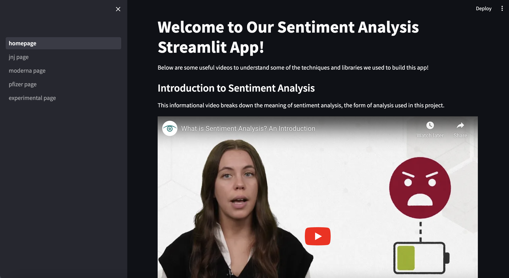
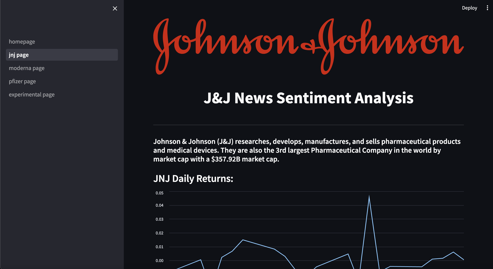
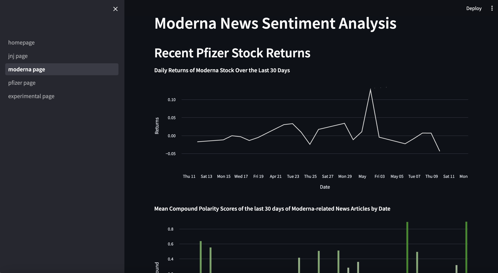
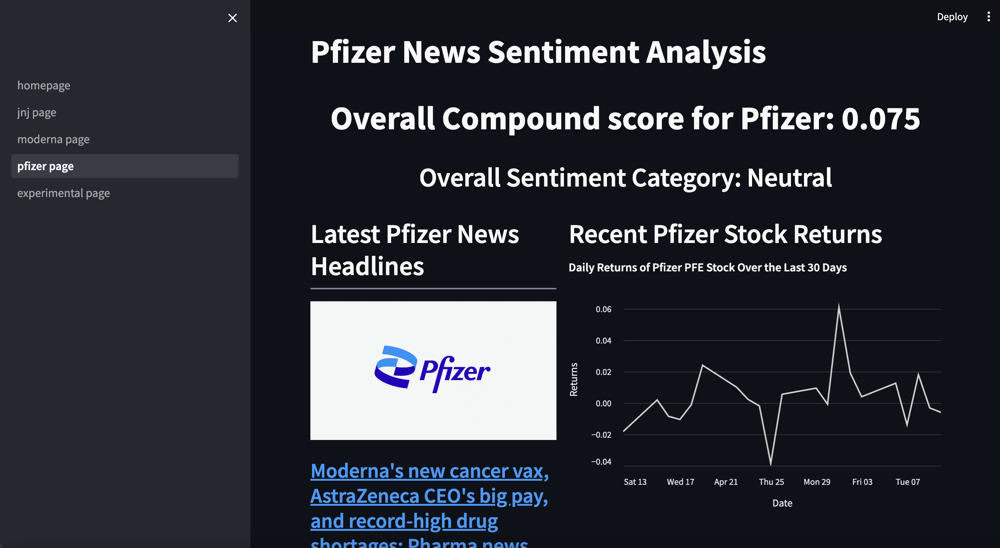
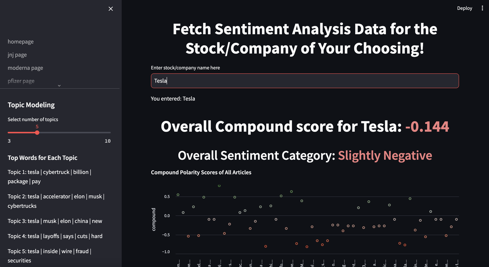

# Sentiment Analysis Project

## Introduction:

Welcome to the Sentiment Analysis Streamlit App! This project provides a user-friendly interface, and provides real-time sentiment analysis of news articles related to various companies or stocks. By analyzing the sentiment of news headlines, users can gain insights into market sentiment and make more informed decisions regarding investment or business strategies.

## Overview:

The Sentiment Analysis Project utilizes Streamlit, a Python library for building interactive web applications, to create a user-friendly interface for accessing and analyzing sentiment data. The project fetches live news data from external sources using the NewsAPI, performs sentiment analysis using the NLTK library, and visualizes the results in an intuitive dashboard.

## Features:

- **Live Data Fetching**: The project fetches live news data from external sources, allowing users to access the latest headlines and sentiment analysis in real-time.

- **Sentiment Analysis**: Utilizing the NLTK library's `.polarity_scores()` function, the project performs sentiment analysis on news headlines to determine the overall sentiment (positive, negative, or neutral) of each article.

- **Interactive Dashboard**: The Streamlit dashboard provides an interactive interface for users to explore sentiment analysis results, visualize sentiment trends over time, and analyze sentiment scores by source or category.

- **Customization**: Users can customize the project by selecting specific companies or stocks of interest, adjusting sentiment analysis parameters, and exploring different visualization options.

## Files Needed:

- **helper_functions.py**: Includes functions to categorize compound scores and translate non-English titles to English using the `googletrans` library.

- **data_extraction.py**: Contains functions to fetch news data from NewsAPI and stock data from Yahoo Finance.

- **pages/3pfizer_page.py, pages/1jnj_page.py, pages/2moderna_page.py**: Streamlit pages featuring sentiment analysis of Pfizer, Johnson & Johnson, and Moderna, respectively with unique visualizations to show different techniques.

- **pages/4experimental_page.py**: A Streamlit page for experimental features. Enter a stock or company's name in the text input box within the application. You can then explore the overall sentiment of your input. 

- **homepage_app.py**: Streamlit homepage featuring short informational videos about Sentiment Analysis and scores produced with the NLTK library `.polarity_scores()` function.

- **.gitignore**: Excludes NewsAPI key in a dotenv file.

## Instructions/How to Run:

1. **Install requirements**: Install the required Python requirements by running `pip install -r requirements.txt`.

2. **Set Up API Keys**: Obtain API keys for NewsAPI and any other external services used in the project, and set them as environment variables.

3. **Run the Application**: Execute `streamlit run homepage.py` in your terminal. This will start the web server and open the project in your default web browser.

4. **Explore and Analyze**: Explore the interactive dashboard, fetch live news data, perform sentiment analysis, and analyze sentiment trends to gain insights into market sentiment.

## Examples of Running Application

*The homepage features videos explaining some of the techical tools used in this project*

### Each individual page features different ways to visualize sentiment analysis results
---

*Users can search a stock of their choosing and receive an overall sentiment score based on News titles regarding that stock.*
## Continuation of Project

• Improve the speed of the application.

• Potentially add a customizable dashboard with Streamlit Elements. 

• Transform the Streamlit app into a standalone website using HTML, CSS, and JavaScript for greater customization and interactivity

#### Sources Used:

- [NewsAPI Documentation](https://newsapi.org/)
- [NLTK Documentation](https://www.nltk.org/data.html)
- [Streamlit Documentation](https://docs.streamlit.io/get-started/tutorials/create-a-multipage-app)
- Sentiment Analysis Videos: [Video 1](https://youtu.be/o-zM8onpQZY?si=601jQUbMJHLpW4HS), [Video 2](https://youtu.be/QpzMWQvxXWk?si=gn7VQeeZmFoF5Bpp)
- [Kaggle Dataset for COVID-19 Vaccine Sentiment Analysis](https://www.kaggle.com/code/twhelan/covid-19-vaccine-sentiment-analysis-with-fastai)
- [Tableau Blog: How to Visualize Sentiment and Inclination](https://www.tableau.com/blog/how-visualize-sentiment-and-inclination-48534)

